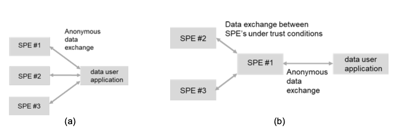

# Waarom dit specificatie document

## Te weinig aandacht voor federatieve oplossingen en het concept van _data visiting_
Ten tijde van het schrijven van dit document zijn een aantal belangrijke richtlijnen in de maak betreffende de uitwerking en implementatie van de EHDS voor secundair gebruik, met name:

- [TEHDAS2](https://tehdas.eu/public-consultations/): gedetailleerde richtlijnen en technische specificiaties in 11 documenten.[^1]
- [Data Spaces Support Center Blueprint](https://dssc.eu/space/BVE2/1071251457/Data+Spaces+Blueprint+v2.0+-+Home): industrie-overstijgende richtlijnen voor inrichting van data spaces.

Deze ontwikkelingen geven een steeds duidelijker beeld van hoe een landelijke gezondheidsdata-infrastructuur voor onderzoek, beleid en innovatie eruit zou kunnen c.q. moeten zien. Tegelijkertijd constateren we een lacune ten aanzien van het hanteren van principes als 'privacy-by-design' en 'data visiting'. In de inleiding van de EHDS wordt in overweging 80 gesteld dat:

> _Gezien de gevoeligheid van gezondheidsgegevens moeten waar mogelijk beginselen als “privacy door ontwerp” en “privacy door standaardinstellingen” en het concept “breng de vragen naar de gegevens in plaats van die gegevens te verplaatsen” in acht worden genomen._

Het concept van _data visiting_, ook wel bekend als _federated computing_ of _Personal Health Train_ (PHT), wordt nergens in de EHDS nader toegelicht[^1]. TEHDAS2 [_M7.4 Draft technical, functional and security specifications of Secure Processing Environments_](./appendix/tehdas2-spe.md) (hoofdstuk 6) gaat hier op in en maakt een aanzet voor de definitie van federated computing.

???+ abstract "Definities federated computing in TEHDAS2"
    
    === "**Gefedereerde berekening (_federated computing_)**"
        Gedecentraliseerde berekening van data waarbij de berekeningen op lokale, gedistribueerde BVOs worden uitgevoerd in plaats van centrale verwerking in één BVO. Een dergelijke aanpak wordt aanbevolen in overweging 80 ten behoeve van _privacy preserving computation_. Gefedereerde berekening maakt het mogelijk om de data dichter bij hun originele locatie te houden waarbij alleen geaggregeerde resultaten of model parameters worden gedeeld, en daarmee privacy en veiligheid verhogen.
    
    === "**Gefedereerde analyse (_federated analysis_)**" 
        Een specifieke vorm van gefedereerde verwerking waarbij statistieken lokaal worden berekend op verschillende, gedistrueerde BVOs. Deze methode is geschikt voor o.a. vergelijkende analyses, multi-centra onderzoek en andere vormen van collaboratieve statistische analyse. Alleen geaggregeerde resultaten of samenvattende statistieken worden uit de lokale BVOs geexporteerd, met bijbehorende waarborgen dat geen persoonsgegevens uit de BVO worden onttrokken.

    === "**Gefedereerd leren (_federated learning_)**"
        Een specifieke vorm van gefedereerde berekening waarbij modellen worden getraind en gevalideerd op gedistribueerde BVOs. De ruwe data wordt niet gedeeld tussen de BVOs. In plaats daarvan worden alleen de model updates gedeeld om daarmee betere data privacy en beveiliging te bereiken. Omdat het moeilijk is om de anonimiteit van tussentijdse resultaten te beoordelen, is het essentieel dat gefedereerd leren gebeurd in een vertrouwd netwerk van BVOs.

    TEHDAS2 maakt onderscheid tussen twee scenarios, namelijk gefedereerde analyse (a) en gefedereerd leren (b).

    

## Een specificatie van een federatieve BVO
Dit document beschrijft een nadere uitwerking van wat in TEHDAS2 een **federatieve BVO** wordt genoemd. Wij denken dat federatieve BVOs een belangrijke bijdrage kunnen leveren aan het effectief, efficiënt èn veilig implementeren van de EHDS. We zien federatieve BVOs als een aanvulling op c.q. alternatief voor centrale BVOs, zoals bijvoorbeeld de CBS Microdata omgeving of de _Trusted Research Environments_ zoals deze in [EOSC-ENTRUST](https://eosc-entrust.eu/) verband worden geïmplementeerd. Data stations zijn daarin voorzien als een essentieel onderdeel voor het realiseren van een open, landelijk dekkend, federatief BVO-netwerk.

[^1]: Deze gedetailleerde functionele en techniscke specificaties van health data spaces c.q. BVOs zijn nog in consultatie-fase en moeten nog door de Europese Commissie vastgesteld. Voor primair gebruik is dit uiterlijk maart 2027, voor secundair gebruik (de scope van TEHDAS2) maart 2029.
[^2]: Het woord _federated_ komt slecht twee keer voor in de EHDS verordening.